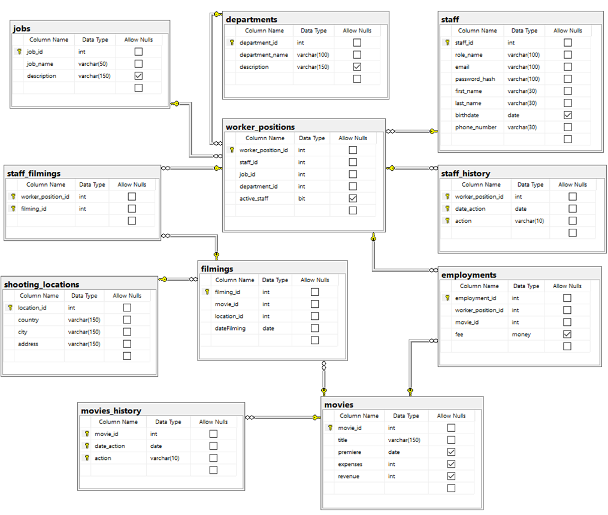
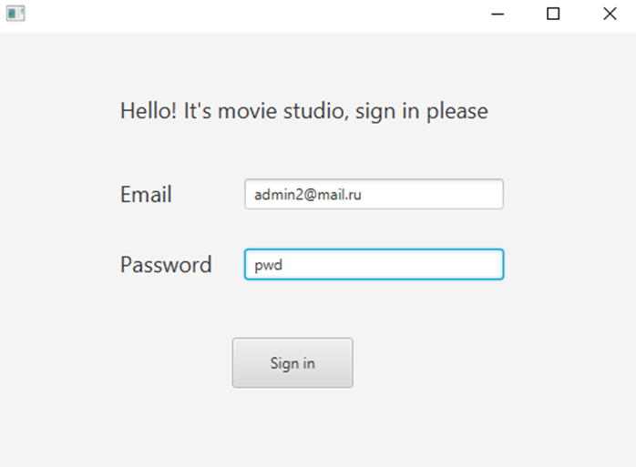
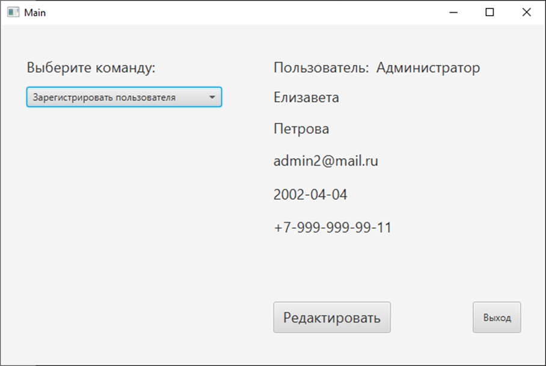
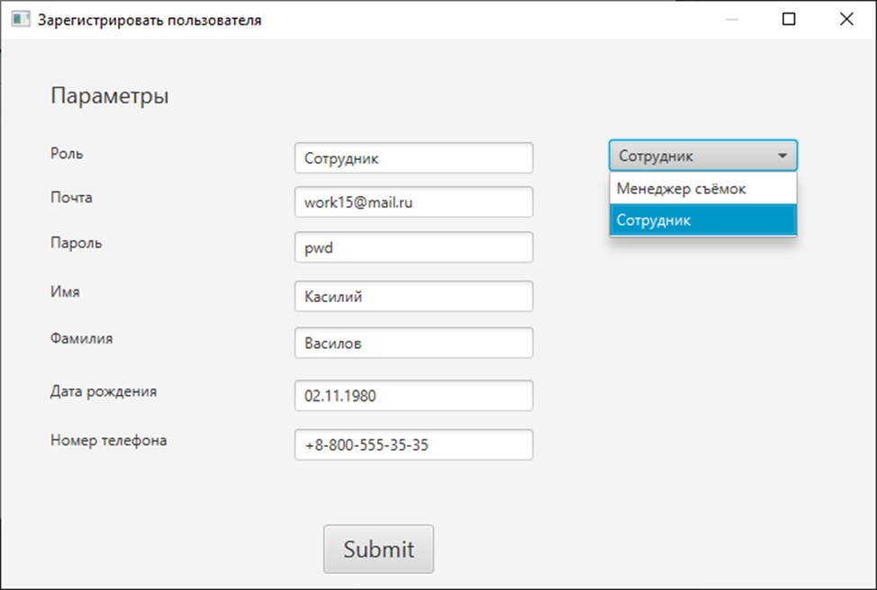
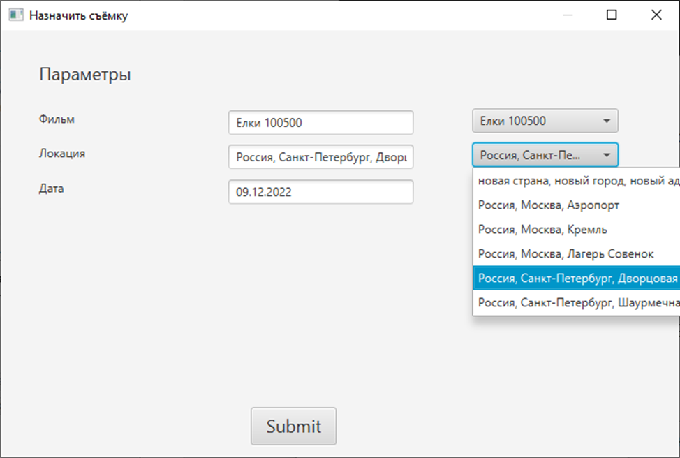

# Курсовой проект "Movie Studio" по предмету "Базы данных"

## Описание

Необходимо было разработать схему базы данных для Киностудии, создать 3 роли пользователей и разработать API для
взаимодействия с БД. В качестве СУБД была использована MSSQL Server, а оконное приложение написано на Java при помощи
графической библиотеки JavaFX.

## Стек технологий:

* MSSQL Server
* Java, JavaFX

## Схема БД

Код создания схемы лежит в файле [tables.sql](sql/tables.sql)

## Роли и запросы

**Были придуманы 3 роли:**

1. Администратор – может регистрировать новых пользователей, добавлять новые фильмы, добавлять персонал в составы
   фильмов, назначать на должности и редактировать различные данные;
2. Менеджер съёмок - имеет такие возможности как назначение съёмок, редактирование информации о съемках и другое;
3. Сотрудник - может просматривать свое расписание, гонорар и информацию о законченных фильмах.

Подробнее с текстом запросов можно ознакомиться в файле [requests.sql.](sql/requests.sql)

О том, каким ролям доступны какие запросы, можно прочитать [тут.](src/main/java/ms_sql_coursework/model/Constants.java)

## Внешний вид

